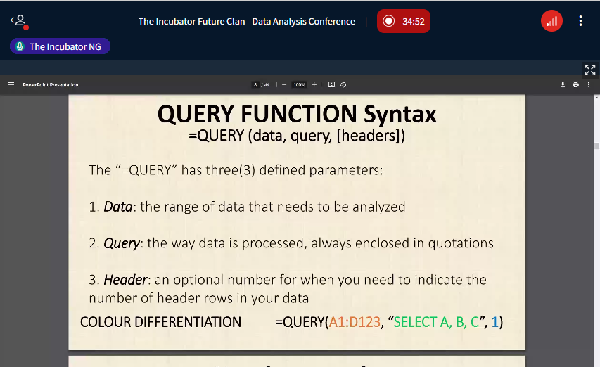

# FCB-Project-Documentation-5.0

## Documentation

## Tools used

 - Microsoft excel [Download here](http/microsoftexceel.com)
 - Microsoft PowerBI
 - MYSQL


```
Goggle query sheet
SELECT * FROM TABLE 1
WHERE CONDITION

```



|Heading1|Heading2|Heading3|
|--------|--------|--------|
| Data 1 | Data 2 | Data 3 |
   
   

   
 
